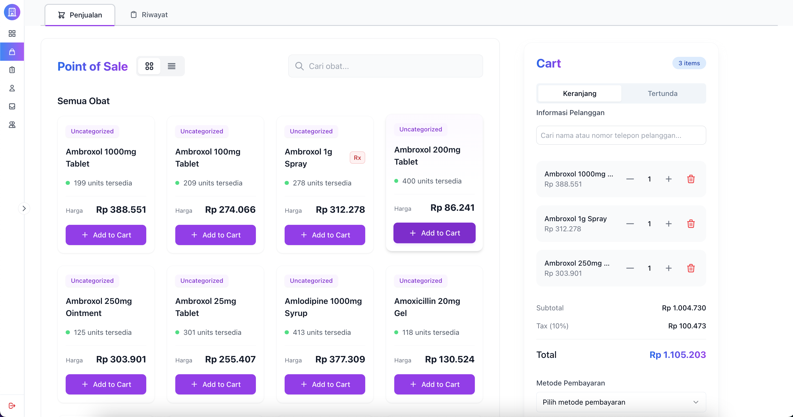

# DigiPharmacy


## Architecture Overview

DigiPharmacy uses a combination of Domain-Driven Design (DDD) and Progressive Architecture to ensure a maintainable and scalable system.

### Core Principles

1. **Domain-Driven Design (DDD)**
   - Focus on business domain
   - Ubiquitous language
   - Bounded contexts
   - Rich domain models

2. **Progressive Architecture**
   - Gradual evolution
   - Interface-first approach
   - Event-driven system
   - Forward compatibility

### Project Structure

```
app/
├── Domain/               # Core business logic (DDD)
│   ├── Auth/
│   │   ├── Models/       # Domain entities
│   │   ├── ValueObjects/ # Value objects
│   │   ├── Events/       # Domain events
│   │   ├── Repositories/ # Repository interfaces
│   │   └── Services/     # Domain services
│   ├── Inventory/
│   └── Order/
│
├── Application/          # Use cases & orchestration
│   ├── Contracts/        # Service interfaces
│   └── Services/         # Application services
│
├── Infrastructure/       # Technical implementations
│   ├── Persistence/      # Database implementations
│   ├── Events/           # Event system
│   └── External/         # External services
│
└── Interface/            # API & UI layer
    ├── Http/
    │   ├── Controllers/
    │   └── Middleware/
    └── Console/
```

### Layer Responsibilities

1. **Domain Layer** (`app/Domain/`)
   - Core business logic and rules
   - Pure PHP, no framework dependencies
   - Entities, value objects, events
   - Repository interfaces

2. **Application Layer** (`app/Application/`)
   - Service interfaces (contracts)
   - Use case orchestration
   - Transaction management
   - Cross-domain coordination

3. **Infrastructure Layer** (`app/Infrastructure/`)
   - Framework integration
   - Database implementations
   - Event handling
   - External services

4. **Interface Layer** (`app/Interface/`)
   - HTTP controllers
   - API endpoints
   - Request validation
   - Response formatting

### Evolution Strategy

1. **Phase 1: MVP (0-3 months)**
   - Simple service implementations
   - Basic domain models
   - Direct database access

2. **Phase 2: Growth (3-6 months)**
   - Event-driven patterns
   - Rich domain models
   - Caching strategies

3. **Phase 3: Stabilization (6-12 months)**
   - Complex use cases
   - Advanced event handling
   - Performance optimizations

4. **Phase 4: Enterprise (12+ months)**
   - Distributed transactions
   - Message queues
   - Advanced monitoring


## Requirements
- PHP 8.2
- Node.js 18+
- MySQL 5.7
- Composer
- nerdctl

## Development Setup

1. **Clone repository**
```bash
git clone <repository-url>
cd digipharmacy
```

2. **Environment Setup**
```bash
# Copy .env file
cp .env.example .env
# Set environment variables
export APP_ENV=local # for development
or
export APP_ENV=production # for production
```

3. **Container Build & Run**
```bash
# First time or when Dockerfile/dependencies change
nerdctl compose up --build

# To run existing containers
nerdctl compose up -d
```


4. **Useful Commands**
```bash
# View logs
nerdctl compose logs -f digipharmacy-app-1

# Enter container
nerdctl compose exec digipharmacy-app-1 sh

# Check container status
nerdctl compose ps
```

## API Development Flow

To add a new API, follow these steps according to Progressive Architecture:

### 1. Interface Definition (Contracts)

Create an interface in `app/Application/Contracts/<Module>/` to define the service contract:

```php
namespace App\Application\Contracts\<Module>;

interface ServiceInterface
{
    public function create(array $data): array;
    public function update(int $id, array $data): array;
    public function delete(int $id): void;
    public function getAll(): array;
}
```

### 2. Domain Events

1. **Base Event** in `app/Infrastructure/Events/DomainEvent.php`:
```php
abstract class DomainEvent
{
    public function __construct(
        public readonly string $id,
        public readonly \DateTime $occurredOn
    ) {
        $this->id = Str::uuid();
        $this->occurredOn = now();
    }

    abstract public function getEventName(): string;
}
```

2. **Specific Events** in `app/Infrastructure/Events/<Module>/`:
```php
class EntityCreated extends DomainEvent
{
    public function __construct(
        public readonly Entity $entity
    ) {
        parent::__construct();
    }

    public function getEventName(): string
    {
        return 'entity.created';
    }
}
```

### 3. Domain Layer

1. **Value Objects** in `app/Domain/<Module>/ValueObjects/`:
```php
class EntityId
{
    public function __construct(
        private readonly string $value
    ) {
        $this->validate($value);
    }

    private function validate(string $value): void
    {
        if (empty($value)) {
            throw new InvalidArgumentException('ID cannot be empty');
        }
    }
}
```

2. **Repository Interface** in `app/Domain/<Module>/Repositories/`:
```php
interface EntityRepositoryInterface
{
    public function findById(EntityId $id): ?Entity;
    public function save(Entity $entity): void;
    public function delete(EntityId $id): void;
}
```

3. **Domain Service** in `app/Domain/<Module>/Services/`:
```php
class EntityService implements EntityServiceInterface
{
    public function __construct(
        private EntityRepositoryInterface $repository
    ) {}

    public function create(array $data): array
    {
        $entity = new Entity($data);
        $this->repository->save($entity);
        Event::dispatch(new EntityCreated($entity));
        return $entity->toArray();
    }
}
```

### 4. Infrastructure Layer

1. **Repository Implementation** in `app/Infrastructure/<Module>/Repositories/`:
```php
class EntityRepository implements EntityRepositoryInterface
{
    public function findById(EntityId $id): ?Entity
    {
        $model = EloquentModel::find($id->value());
        return $model ? EntityMapper::toDomain($model) : null;
    }
}
```

2. **Event Listeners** in `app/Infrastructure/<Module>/Listeners/`:
```php
class EntityCreatedListener
{
    public function handle(EntityCreated $event): void
    {
        // Handle the event
        Log::info('Entity created: ' . $event->entity->id);
    }
}
```

### 5. Interface Layer

1. **Controller** in `app/Http/Controllers/<Module>/`:
```php
class EntityController
{
    public function __construct(
        private EntityServiceInterface $service
    ) {}

    public function store(Request $request): JsonResponse
    {
        $validated = $request->validate([
            'name' => 'required|string',
            'description' => 'required|string'
        ]);

        $result = $this->service->create($validated);

        return response()->json($result, 201);
    }
}
```

2. **Routes** in `routes/api.php`:
```php
Route::prefix('v1')->group(function () {
    Route::apiResource('entities', EntityController::class);
});
```

### 6. Service Provider

Register in `app/Providers/<Module>ServiceProvider.php`:
```php
class ModuleServiceProvider extends ServiceProvider
{
    public function register(): void
    {
        $this->app->bind(
            EntityServiceInterface::class,
            EntityService::class
        );

        $this->app->bind(
            EntityRepositoryInterface::class,
            EntityRepository::class
        );
    }
}
```

## Development Checklist

### 1. Preparation
- [ ] Identify new domain/module
- [ ] Review related existing code
- [ ] Define interfaces and contracts

### 2. Core Implementation
- [ ] Create service interface in `/Application/Contracts`
- [ ] Create base event (if not exists)
- [ ] Create specific events
- [ ] Implement value objects
- [ ] Implement repository interface
- [ ] Implement domain service

### 3. Infrastructure
- [ ] Implement repository
- [ ] Create event listeners
- [ ] Setup database migrations (if needed)

### 4. Interface
- [ ] Create controller
- [ ] Define routes
- [ ] Implement request validation

### 5. Dependency Injection
- [ ] Register interface bindings in service provider
- [ ] Register event listeners

### 6. Testing
- [ ] Unit tests for domain logic
- [ ] Integration tests for API
- [ ] Event handling tests

### 7. Documentation
- [ ] Update API documentation
- [ ] Update README if needed
- [ ] Document any new patterns used

### 2. Infrastructure Layer (Technical Implementation)

Infrastructure layer contains technical implementations of contracts defined in the domain layer.

1. **Create Model Mapper** - *Transformer between domain and persistence model*
   Mapper responsibilities:
   - Convert Eloquent model to Domain model
   - Convert Domain model to Eloquent model
   - Handle model relationships
   - Transform data types if needed in `app/Infrastructure/<Module>/Mappers/`
   ```php
   namespace App\Infrastructure\<Module>\Mappers;
   
   class YourModelMapper
   {
       public function toDomain(EloquentModel $eloquent): DomainModel
       {
           return new DomainModel(
               name: $eloquent->name,
               id: $eloquent->id
           );
       }
   }
   ```

2. **Create Repository Implementation** - *Concrete data access implementation*
   Repository contains:
   - Implementation of interface methods
   - Query builder for database
   - Caching strategy if needed
   - Database-specific error handling in `app/Infrastructure/<Module>/Repositories/`
   ```php
   namespace App\Infrastructure\<Module>\Repositories;
   
   class YourModelRepository implements YourModelRepositoryInterface
   {
       public function __construct(
           private YourModelMapper $mapper
       ) {}
       
       // Implementation methods
   }
   ```

### 3. Container & Service Provider (Dependency Management)

Container and Service Provider handle dependency injection and object lifecycle.

1. **Create Container** - *Factory for services and dependencies*
   Container responsibilities:
   - Instantiate services and dependencies
   - Provide singleton instances if needed
   - Manage object lifecycle
   - Simplify dependency graph in `app/Infrastructure/Container/`
   ```php
   namespace App\Infrastructure\Container;
   
   class YourContainer
   {
       public function getYourService(): YourService
       {
           return new YourService(
               $this->getYourRepository()
           );
       }
       
       public function getYourRepository(): YourRepositoryInterface
       {
           return new YourRepository(
               $this->getYourMapper()
           );
       }
   }
   ```

2. **Create/Update Service Provider** - *Register services to Laravel*
   Provider responsibilities:
   - Bind interfaces to implementations
   - Register singleton services
   - Initial service configuration
   - Boot-time initialization in `app/Providers/`
   ```php
   namespace App\Providers;
   
   class YourDomainServiceProvider extends ServiceProvider
   {
       public function register(): void
       {
           $this->app->bind(YourRepositoryInterface::class, function () {
               return $this->container->getYourRepository();
           });
           
           $this->app->bind(YourService::class, function () {
               return $this->container->getYourService();
           });
       }
   }
   ```

3. **Register Service Provider** - *Activate service in application*
   Registration in config:
   - Add provider to application providers
   - Configure loading order
   - Determine environment (local/production) in `config/app.php`
   ```php
   'providers' => ServiceProvider::defaultProviders()->merge([
       // ...
       App\Providers\YourDomainServiceProvider::class,
   ])->toArray(),
   ```

### 4. Controller & Route (Interface Layer)

Interface layer handles HTTP request/response and routing.

1. **Create Controller** - *Handler for HTTP requests*
   Controller responsibilities:
   - Receive HTTP requests
   - Validate input
   - Call domain service
   - Format response
   - HTTP-level error handling in `app/Http/Controllers/`
   ```php
   namespace App\Http\Controllers;
   
   class YourController extends Controller
   {
       public function __construct(
           private YourService $service
       ) {}
       
       public function index()
       {
           $result = $this->service->getAll();
           return response()->json($result);
       }
   }
   ```

2. **Add Route** - *Define API endpoint*
   Route configuration:
   - HTTP method (GET, POST, PUT, DELETE)
   - URL pattern
   - Middleware (auth, throttle, cors)
   - Route grouping
   - Route naming in `routes/api.php`
   ```php
   Route::middleware('auth:sanctum')->group(function () {
       Route::get('/your-endpoint', [YourController::class, 'index']);
   });
   ```

By following this flow, we ensure:
1. Good separation of concerns
2. Structured dependency injection
3. Good testability
4. Maintainable and scalable code

## Architecture Evolution

DigiPharmacy uses Progressive Architecture to support gradual system evolution:

### 1. Project Structure
```
app/
├── Domain/           # Core business logic & rules
│   ├── Auth/
│   ├── Inventory/
│   └── Order/
├── Application/      # Use cases & application services
│   ├── Contracts/    # Interfaces
│   └── Services/     # Integration services
└── Infrastructure/   # Technical implementations
    └── Events/       # Event system
```

### 2. Development Phases

#### Phase 1: MVP (0-3 months)
- Simple Integration Services
- Basic Domain Events
- Repository Pattern
- Focus: Core functionality

#### Phase 2: Growth (3-6 months)
- Event-Driven Architecture
- Async Operations
- Enhanced Domain Logic
- Focus: Scalability

#### Phase 3: Stabilization (6-12 months)
- Use Case Pattern
- Complex Orchestration
- Advanced Event Handling
- Focus: Maintainability

#### Phase 4: Enterprise (12+ months)
- Saga Pattern
- Message Queue
- Distributed Transactions
- Focus: Reliability

### 3. Progressive Implementation

#### Services
```php
// Interface ready for evolution
interface OrderServiceInterface {
    public function createOrder(array $data): Order;
}

// Simple first implementation
class OrderService implements OrderServiceInterface {
    public function createOrder(array $data): Order {
        return Order::create($data);
    }
}
```

#### Events
```php
// Base event structure
abstract class DomainEvent {
    public function __construct(
        public readonly string $id,
        public readonly \DateTime $occurredOn
    ) {}
}

// Simple event implementation
class OrderCreated extends DomainEvent {
    public function __construct(
        public readonly Order $order
    ) {
        parent::__construct(Str::uuid(), now());
    }
}
```

### 4. Benefits

1. **Minimal Refactoring**
   - Forward-compatible interfaces
   - Extensible structure
   - Event system ready

2. **Flexible Evolution**
   - Gradual complexity increase
   - No major restructuring
   - Backward compatible

3. **Clean Migration Path**
   - Progressive enhancement
   - No breaking changes
   - Step-by-step improvement

4. **Team Scalability**
   - Clear documentation
   - Consistent standards
   - Easy onboarding

# Stop container
nerdctl compose down

# Rebuild specific service
nerdctl compose up -d --build digipharmacy-app-1

## Project Structure

├── resources/
│ ├── js/
│ │ ├── components/
│ │ │ └── App.tsx
│ │ └── app.tsx
│ └── views/
│ └── app.blade.php
├── docker-compose.yml
├── Dockerfile
├── package.json
├── tsconfig.json
└── vite.config.js


## Development vs Production

### Development Mode
```bash
export APP_ENV=local
# First time or when Dockerfile changes
nerdctl compose up --build

# For daily development
nerdctl compose up -d

# After container is running, run npm run dev
nerdctl exec -it digipharmacy-app-1 sh
lsof -i :5173
kill -9 <PID>
npm run dev
```

Development mode will:
- Run Laravel server on port 8000
- Run Vite dev server on port 5173
- Enable hot reload for React components
- Allow debugging

Make sure to run `npm run dev` after container is up because:
1. Container needs to be fully running first
2. Vite dev server needs to run for hot reload
3. Development dependencies need to be properly installed

### Production Mode
```bash
export APP_ENV=production
# Rebuild if there are changes to Dockerfile or dependencies
nerdctl compose up --build

# If no changes, just run
nerdctl compose up -d
```

- Assets are built and minified
- Cache is optimized
- Performance is optimized
- Access: http://localhost:8000

## Docker Configuration

### Multi-stage Build
Dockerfile uses multi-stage build for optimization:
1. Build stage: Compile React/TypeScript assets
2. Production stage: Setup PHP and application

### Volume Mounts
- `.:/var/www`: Source code
- `/var/www/html/node_modules`: Node modules (preserved in container)

### Ports
- 8000: Laravel application
- 5173: Vite dev server
- 3306: MySQL database

## Tech Stack
- Laravel
- React
- TypeScript
- Vite
- MySQL
- Docker/nerdctl

## Notes
- Development mode uses Vite dev server for hot reload
- Production mode uses pre-built assets
- Database credentials can be configured through environment variables
